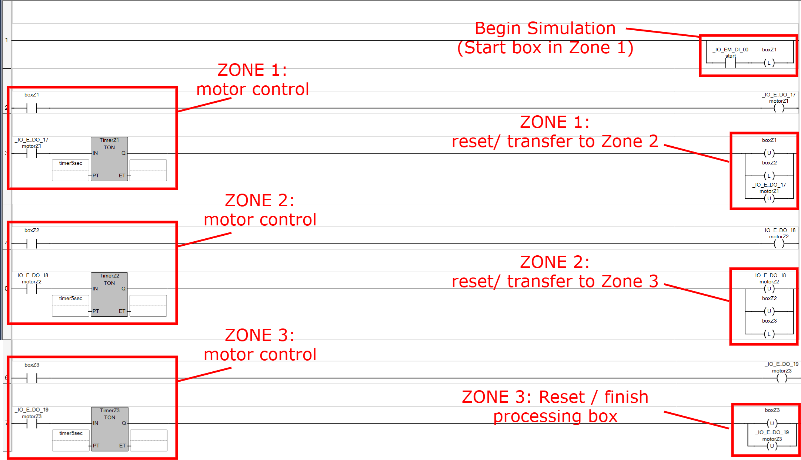

# controlsPractice
Basic Controls Practice - Thomas Garry:

This is my second attempt at building a basic control system to learn industrial automation / controls engineering. This version was built in Rockwell Automation Connected Components Workbench and runs on a simulated Micro800 PLC. It simulates a multi-zone conveyor system where boxes are detected, processed, and handed off between zones. Each zone has its own motor logic and timers to model realistic travel/transfer delays, and the system supports multiple boxes moving through the line at once.

   
  <em>Annotated Ladder Logic for this system</em>   

 

## Variables / Tags
| Variable | Type (I/O/Internal) | PLC Tag | Description |
|---|---|---|---|
| `Start` | Input | _IO_EM_DI_00 | Starts the conveyor sequence (simulated pushbutton / photoeye). |
| `boxZ1` | Internal | N/A | Box present at the end of Zone 1 (zone “occupied” / photoeye state). |
| `boxZ2` | Internal | N/A | Box present at the end of Zone 2 (zone “occupied” / photoeye state). |
| `boxZ3` | Internal | N/A | Box present at the end of Zone 3 (zone “occupied” / photoeye state). |
| `motorZ1` | Output | _IO_EM_DO_17 | Motor command for Zone 1 conveyor. |
| `motorZ2` | Output | _IO_EM_DO_18 | Motor command for Zone 2 conveyor. |
| `motorZ3` | Output | _IO_EM_DO_19 | Motor command for Zone 3 conveyor. |
| `TimerZ1` | Internal | N/A | TON timer used for Zone 1 transfer timing. |
| `TimerZ2` | Internal | N/A | TON timer used for Zone 2 transfer timing. |
| `TimerZ3` | Internal | N/A | TON timer used for Zone 3 transfer timing. |
| `timer5sec` | Internal | N/A | Preset delay used for transfer timing (`T#5s`). |

## Video Demonstration
https://youtu.be/DSuxA2yHDgA

