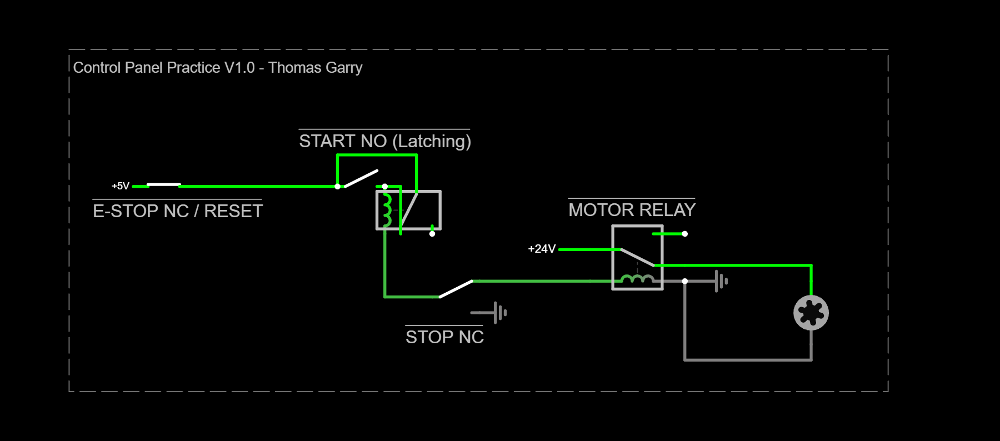

# controlsPractice
Basic Controls Practice - Thomas Garry:

This is my first attempt at creating a basic control panel in an effort to learn about controls engineering. The panel features two relays: one which latches when a pushbutton closes, and a second that drives a DC motor from a separate power source. The second motor also latches with the first, as it is in series with it. An emergency stop switch is included to quickly disable power to both relays. 

   
  <em>Simulated control panel</em>   

 

   
  <em>Annotations</em>     

## Schematic Simulation

   

https://tinyurl.com/22cbvgn4   

## Ladder Logic

   

https://app.plcsimulator.online/yldhXnQoVXLf9gkMOwvU   

## Video Demonstration
https://www.youtube.com/watch?v=fEr9Mut5nHM&si=KLt8cnKjvCtuURNE
